# Creating a Balancer Pool

## Creating and Configuring a Balancer Pool via Etherscan

If you’re all about beautiful UIs and smooth UXs, please wait until Balancer Labs comes up with the perfect dapp for creating your own pool with one click.

This tutorial is for the trailblazers. It purposefully goes over each transaction needed and by the time you’re done you should understand what actually happens under the hood.

Maybe this even inspires you to create your own shiny toys on top of Balancer.

You’ll need to have [Metamask](https://metamask.io/) installed \(or an alternative Web3 wallet/browser\) and have acquired a small amount of the tokens desired for your pool. Some basic knowledge of how Ethereum works is highly desirable, but not an absolute requirement. Let’s go!

### Pool Creation

Balancer Pools are created by calling a function at the BFactory contract.

So to get started we go to the “Write Contract” tab of the BFactory contract on Etherscan to check out the available functions.

[https://etherscan.io/address/0x9424b1412450d0f8fc2255faf6046b98213b76bd\#writeContract](https://etherscan.io/address/0x9424b1412450d0f8fc2255faf6046b98213b76bd#writeContract)

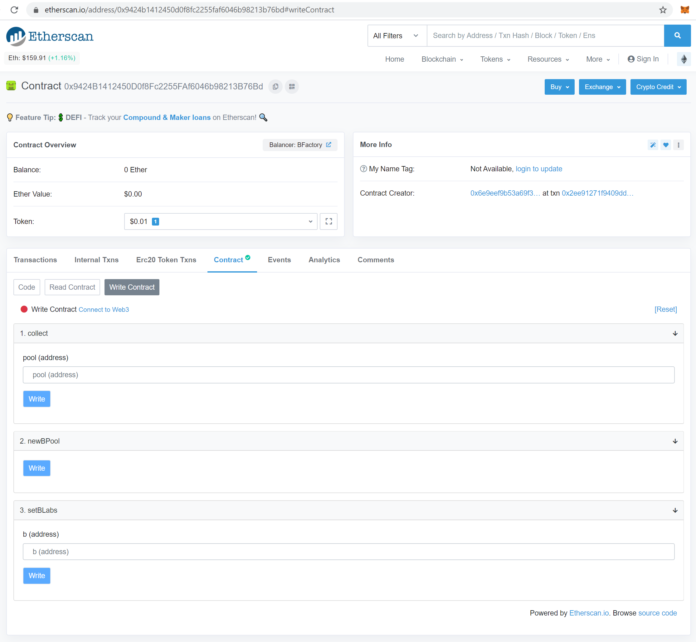

To let our Metamask wallet interact with the site, we click on “Connect to Web3”.

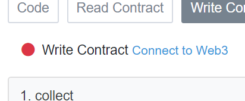

And we’re ready to call the function newBPool by clicking “Write”.

 

Note this is a gas intensive operation, so be mindful of the chosen gas price. The actual gas spent in this transaction is a little under 5M gas, so you may reduce the "Gas Limit" of the metamask transaction. Click “Confirm”.

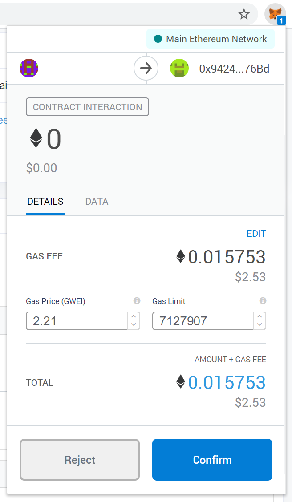

After the transaction has been mined we can navigate to its “Event Logs” tab to find out the address of our new Balancer pool. Hooray!

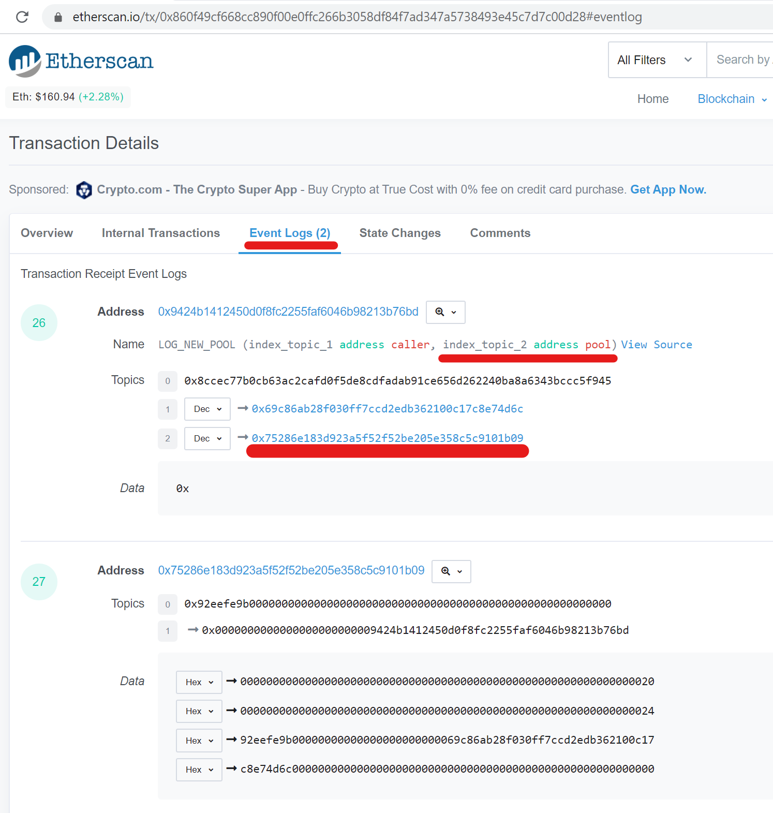

### Configuring the Pool

From now on, we’ll interact directly with the new pool. Click on its address and navigate to its “Write Contract” tab:

[https://etherscan.io/address/0x75286e183d923a5f52f52be205e358c5c9101b09\#writeContract](https://etherscan.io/address/0x75286e183d923a5f52f52be205e358c5c9101b09#writeContract)

We’ll need to:

1. Send tokens to the pool, setting their respective weights \(this action is called “binding”\)
2. Set a swap fee \(the fee paid by traders to liquidity providers\)
3. Turn the pool on for swapping

Let’s go over them in greater detail.

#### Binding tokens

We do this one token at a time.

Check the number of decimals of the token. On Etherscan, it’s here:

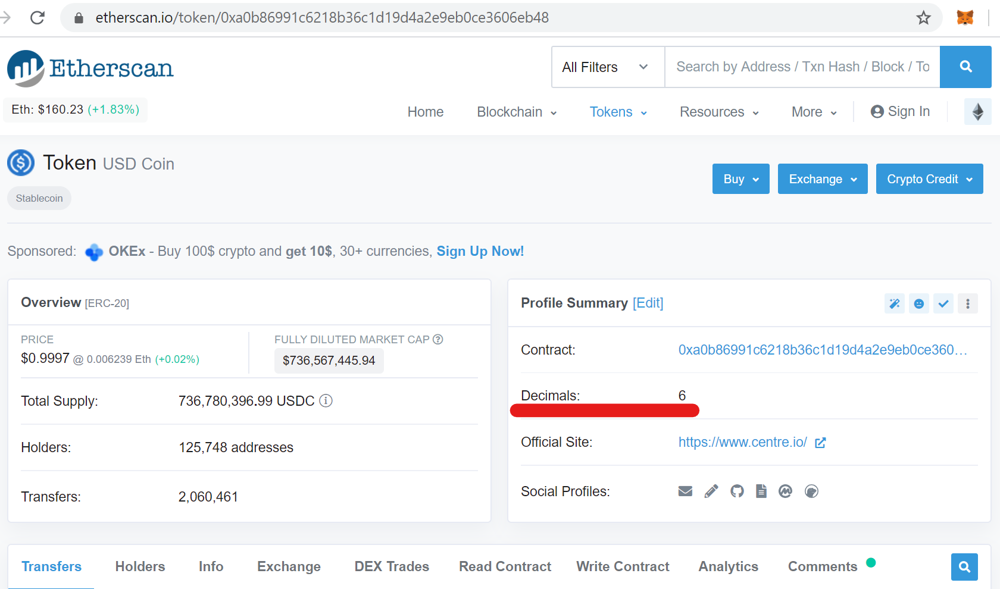

And as you likely already know, we’ll have to authorize the pool to pull a certain balance of this token out of our wallet. This process is technically called “approving an allowance”, and sometimes referred to as “unlocking” or “enabling” the token.

Simply go to that token’s contract page and find the “Contract - Write” or “Contract - Write as Proxy” tab.

[https://etherscan.io/address/0xa0b86991c6218b36c1d19d4a2e9eb0ce3606eb48\#writeProxyContract](https://etherscan.io/address/0xa0b86991c6218b36c1d19d4a2e9eb0ce3606eb48#writeProxyContract)

We’ll approve an allowance of 20 USDC to the pool, which means we’re trusting this contract with this much balance \(even though the tokens don’t leave your wallet right away\).

Now we call approve\(pool\_address, desired\_allowance\_in\_base\_units\). For our desired allowance, the numeric field will be set to 20 USDC x 106 decimals = 20000000 base units. It’ll look like this:

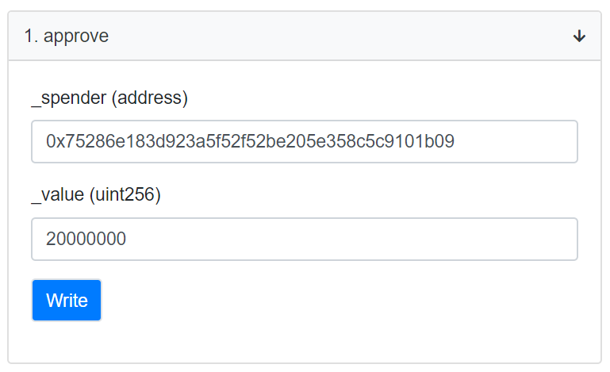

Metamask will ask if you this:

But Etherscan isn’t spending anything. Metamask should actually ask: do you trust the contract at address 0x7528...1b09 to pull up to 20 USDC from your wallet? Yes, we do.

Now let’s get back to our pool’s contract.

The weight \(percentage\) of a token within the pool is chosen with the “denorm” field. It’s a denormalized variable, meaning the sum of all denorm values doesn’t have to equal a specific number.

As a protocol requirement, the value of denorm must range between 1 x 1018 and 50 x 1018. A good rule of thumb is to choose a value that is half of the desired percentage times 1018. This way the pool will allow each token to have any percentage between 2% and 98%.

First we determine how much money the pool will start with. Let’s say it’s $10.

Suppose our intention is to have 15% of the pool’s total value in USDC, so $1.50. We should then bind 1.50 USDC to the pool \(balance = 1.5 \* 10decimals\), with a denorm of 7.5 x 1018.

Click “Write”. After the transaction is mined, check that the amount of tokens sent matches what you expected.

Now we need to bind the remaining 85% of the pool: $8.50 worth and 42.5 x 1018 of denorm.

Our second token will be DAI, at a 20% weight.

[https://etherscan.io/token/0x6b175474e89094c44da98b954eedeac495271d0f](https://etherscan.io/token/0x6b175474e89094c44da98b954eedeac495271d0f)

Being the DeFi trailblazer that you are, you already know what to do:

1. Approve a DAI allowance to the pool.
2. Bind $2 worth of DAI \(currently about 1.975 DAI\) with a denorm of 10 x 1018.

This is what our second call to bind should look like:

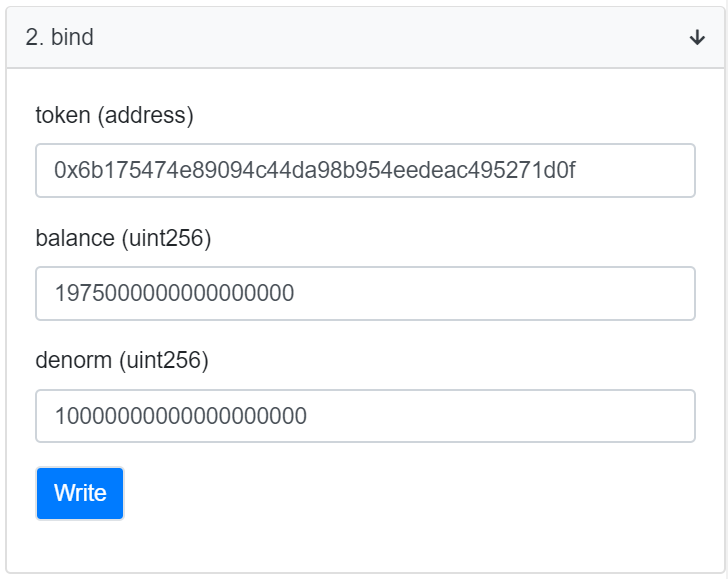

Our third and final token will be PieDAO’s BTC++.

[https://etherscan.io/token/0x0327112423f3a68efdf1fcf402f6c5cb9f7c33fd](https://etherscan.io/token/0x0327112423f3a68efdf1fcf402f6c5cb9f7c33fd)

First we approve a BTC++ allowance to our pool.

Targeting the remaining 65% of the pool’s value, we should bind $6.50 worth \(about 0.000965 BTC++, or 9.65 x 10-4 x 1018 = 9.65 x 1014\), with a denorm of 32.5 x 1018. Easy peasy:

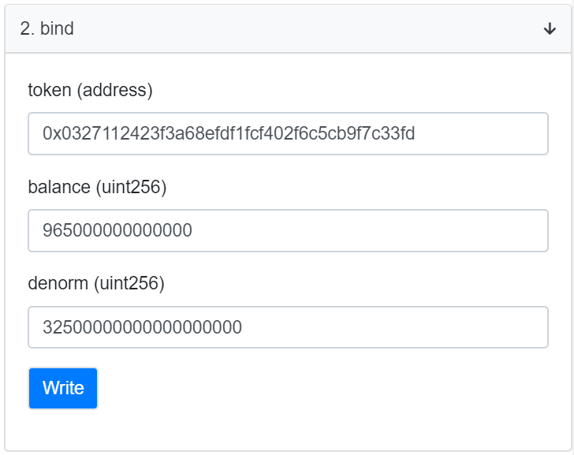

Just to make sure everything is fine, we can go to the pool’s “Contract - Read” tab and check the bound tokens:

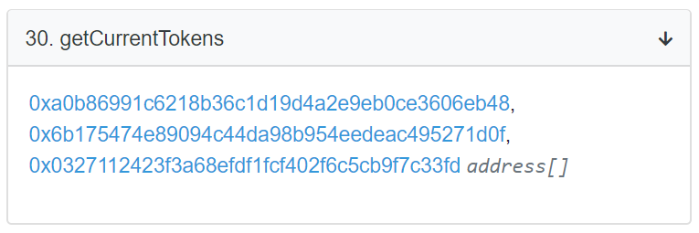

And we can check the pool’s token balances as well, at:

[https://etherscan.io/tokenholdings?a=0x75286e183d923a5f52f52be205e358c5c9101b09](https://etherscan.io/tokenholdings?a=0x75286e183d923a5f52f52be205e358c5c9101b09)

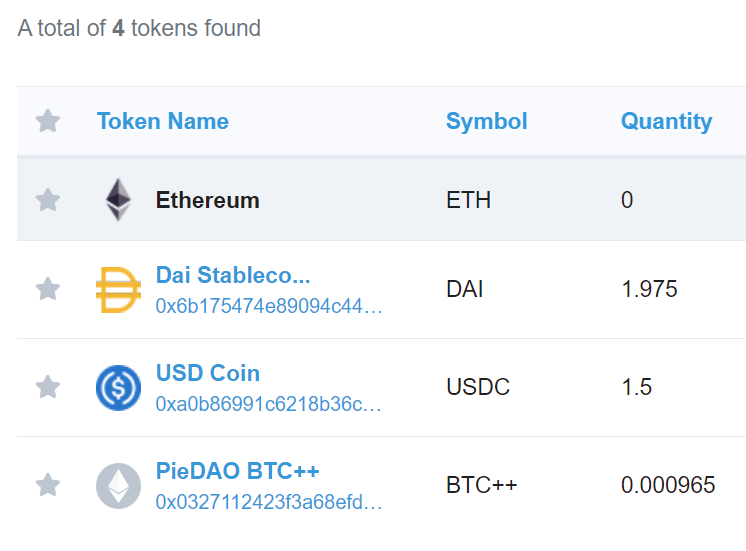

Looking good.

#### Setting the swap fee

At its first version, the Balancer protocol doesn’t charge a protocol-level fee. But liquidity providers do charge a swap fee from traders.

When a pool is created, its swap fee is initialized to the minimum value allowed by the protocol: 0.0001% \(aka 0.000001 or one hundredth of a basis point\). Since a fee of 1 is expressed as 1018 base units, our initial value is 1012 base units:

As a rule of thumb, when the assets within the pool have typically more stable price ratios \(amongst each other\) the fees should be lower, and vice-versa. This way the pool tends to have a better chance at being sufficiently attractive to both traders and liquidity providers.

Let’s say for this pool we want a fee of 0.29%.

We can accomplish this with a simple call to setSwapFee\(0.0029 x 1018 = 2.9 x 1015\):

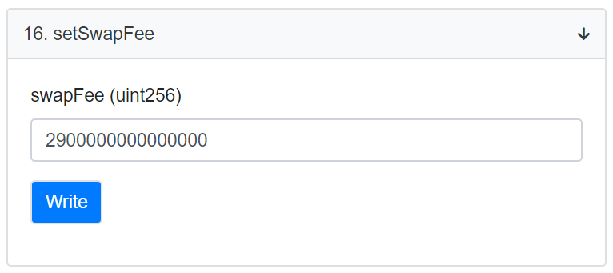

#### Rebinding tokens

Are finally we ready to kick this thing into life?

Well... the price of BTC++ in the external market has changed in the meantime, relative to these stablecoins. If we just make the pool tradeable now, we’re giving away arbitrage opportunities for free. In order to avoid that, we might as well practice how to change some of the pool properties. Bring it on. 😁

By the way, we can still request changes to the pool because it hasn’t yet been finalized. Once we finalize it, we lose control over it: the pool becomes unchangeable and anyone can start adding liquidity to it.

Back to rebinding.

Let’s say that we want to keep the already configured pool distribution \(65/20/15\), so we won’t change any weights. This means the variable denorm should stay put.

With constant weights, to adjust price ratios we need to adjust balances. Let’s make BTC++ more expensive \(against both DAI and USDC\) by making it more scarce in the pool: adjusting down its balance to 0.0009636. We just need to rebind it with the desired values:

With this action, the pool automatically pulls an amount of tokens from our wallet or gives us an amount back, whatever is needed to make up for the difference between the previous bound state and the new bound state.

In this case, 0.000965 BTC++ was bound, so to rebind this token to a balance of 0.0009636 the pool will spit out the excess 0.0000014 BTC++.

#### Allow for trading

At the time this pool was created, there was no pool containing both BTC++ and DAI. So at Balancer’s Exchange dapp when BTC++ was selected as the token to sell, the “Token to Buy” selector couldn’t find a pool to satisfy the trade with against DAI. It looked like this:

[https://balancer.exchange/\#/swap](https://balancer.exchange/#/swap)

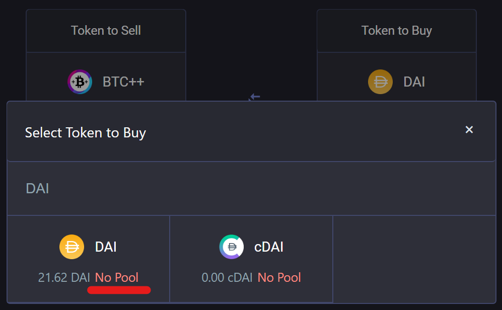

But we can change that. We proceed with a call to setPublicSwap\(true\):

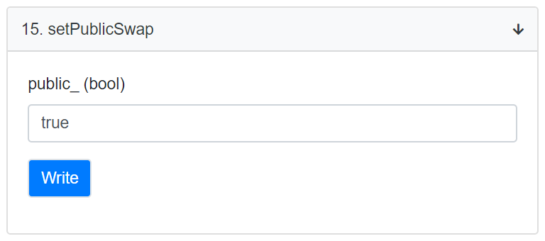

And... “Hello, world!” 📡

We have now successfully created our very own, custom-made automated market maker. And it’s live on Ethereum!

The underlying tokens within the pool are now directly tradeable against each other by anyone who calls this pool’s trading functions:

* retail traders using dapps that have already integrated the Balancer protocol,
* aggregators such as 1inch,
* arbitrage bots,
* and so on.

And of course... The trade BTC++/DAI now finds a pool at Balancer’s Exchange dapp. 😅

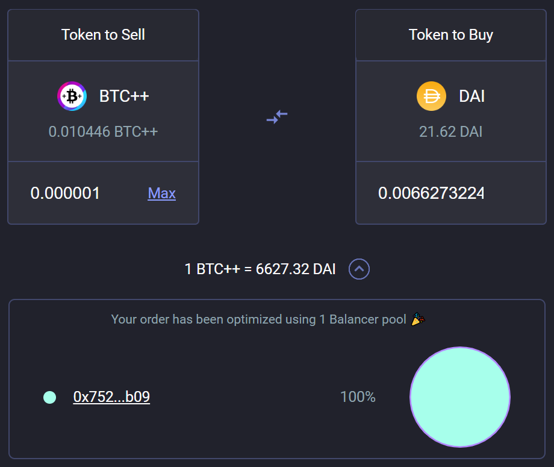

### Finalizing the pool

This is an optional step.

If we keep the pool unfinalized, it’s a **private pool**, and its creator may still freely call functions that change the pool behavior, such as “rebind” and “setSwapFee”.

Very important: finalizing the pool is a one-way street. You can’t go back from it.

When you call finalize\(\), you lose any privilege over the pool. It’s now immutable: a **shared pool**, and anyone can add liquidity to it.

We head over to the Balancer Pool Management dapp and find it listed along with all other shared pools. We can then select it and proudly take a look at our creation:

[https://pools.balancer.exchange/\#/pool/0x75286e183D923a5F52F52be205e358c5C9101b09](https://pools.balancer.exchange/#/pool/0x75286e183D923a5F52F52be205e358c5C9101b09)

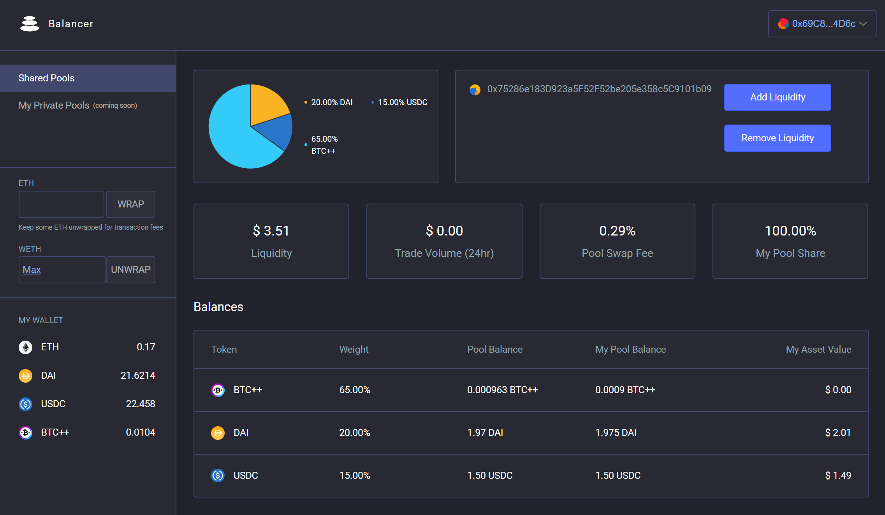

